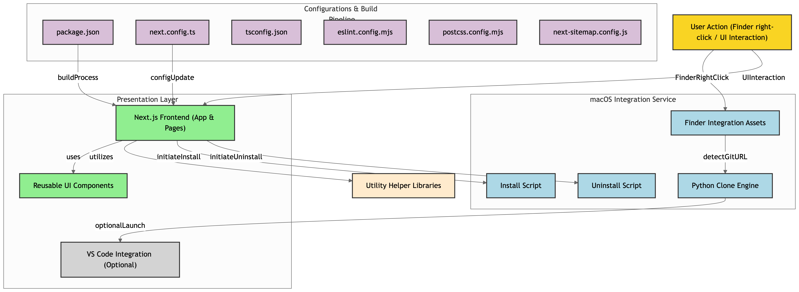

[![Contributors][contributors-shield]][contributors-url]
[![Forks][forks-shield]][forks-url]
[![Stargazers][stars-shield]][stars-url]
[![Issues][issues-shield]][issues-url]
[![LinkedIn][linkedin-shield]][linkedin-url]

<div id="top"></div>

<br />
<div align="center">
   <a href="https://github.com/lorenzopalaia/turboclone">
      
   </a>

<h3 align="center">TurboClone</h3>

   <p align="center">
      An open-source tool for macOS that simplifies cloning GitHub repositories directly from Finder, eliminating the need for terminal commands.
      <br />
      <a href="https://turboclone.lorenzopalaia.com/">View Demo</a>
   </p>
</div>

<!-- ABOUT THE PROJECT -->

## About The Project

TurboClone integrates seamlessly with macOS, allowing you to clone GitHub repositories with just a right-click in Finder. No more terminal commands needed!

<p align="right">(<a href="#top">back to top</a>)</p>

### Key Features

- **One-Click Cloning**: Right-click any folder in Finder and select TurboClone to instantly clone a GitHub repository.
- **Smart Clipboard Detection**: Copy a GitHub repository URL, and TurboClone will automatically detect it, streamlining the cloning process.
- **Native macOS Integration**: Designed exclusively for Mac, TurboClone integrates seamlessly into your daily workflow.
- **VS Code Integration**: Open your newly cloned repository directly in Visual Studio Code with a simple checkbox option.

### System Design



<p align="right">(<a href="#top">back to top</a>)</p>

<!-- GETTING STARTED -->

## Getting Started

### Installation

**Note**: TurboClone requires Python to be installed on your system. If Git is not present, it will be installed automatically using Homebrew, if available.

1. Open Terminal and run the following command:
   ```sh
   curl -sS https://turboclone.lorenzopalaia.com/install.sh | sh
   ```

<p align="right">(<a href="#top">back to top</a>)</p>

## Usage

1. **Copy the GitHub Repository URL**:
   Visit a GitHub repository and copy its URL. TurboClone will automatically detect it from your clipboard.

2. **Clone with a Right-Click**:
   Right-click on any folder in Finder and select "TurboClone" from the context menu. If you've copied a GitHub URL, the cloning will start immediately; otherwise, you'll be prompted to enter a repository URL.

3. **Open in VS Code (Optional)**:
   Enable the "Open in VS Code after cloning" option to automatically open the repository in Visual Studio Code after it's cloned (requires the VS Code command line tool to be installed).

<p align="right">(<a href="#top">back to top</a>)</p>

## Uninstallation

To remove TurboClone from your system, run the following command in Terminal:

```sh
curl -sS https://turboclone.lorenzopalaia.com/uninstall.sh | sh
```

This script will safely remove all TurboClone components, including the Finder service and installed scripts.

<p align="right">(<a href="#top">back to top</a>)</p>

## Contributing

Contributions are welcome! If you have suggestions or improvements, follow these steps:

1. Fork the Project
2. Create your Feature Branch (`git checkout -b feature/AmazingFeature`)
3. Commit your Changes (`git commit -m 'Add some AmazingFeature'`)
4. Push to the Branch (`git push origin feature/AmazingFeature`)
5. Open a Pull Request

Don't forget to give the project a star! Thanks again.

<p align="right">(<a href="#top">back to top</a>)</p>

### Install and Run Locally

To set up the TurboClone project locally:

1. Clone the repository:

   ```sh
   git clone https://github.com/lorenzopalaia/turboclone.git
   cd turboclone
   ```

2. Install dependencies:

   ```sh
   npm install
   ```

3. Start the development server:

   ```sh
   npm run dev
   ```

   The application will be available at `http://localhost:3000/`.

<p align="right">(<a href="#top">back to top</a>)</p>

## License

Distributed under the MIT License. See `LICENSE.txt` for more information.

<p align="right">(<a href="#top">back to top</a>)</p>

## Contact

Lorenzo Palaia - [lorenzopalaia53@gmail.com](mailto:lorenzopalaia53@gmail.com)

Project Link: [https://github.com/lorenzopalaia/turboclone](https://github.com/lorenzopalaia/turboclone)

<p align="right">(<a href="#top">back to top</a>)</p>

<!-- MARKDOWN LINKS & IMAGES -->

[contributors-shield]: https://img.shields.io/github/contributors/lorenzopalaia/turboclone.svg?style=for-the-badge
[contributors-url]: https://github.com/lorenzopalaia/turboclone/graphs/contributors
[forks-shield]: https://img.shields.io/github/forks/lorenzopalaia/turboclone.svg?style=for-the-badge
[forks-url]: https://github.com/lorenzopalaia/turboclone/network/members
[stars-shield]: https://img.shields.io/github/stars/lorenzopalaia/turboclone.svg?style=for-the-badge
[stars-url]: https://github.com/lorenzopalaia/turboclone/stargazers
[issues-shield]: https://img.shields.io/github/issues/lorenzopalaia/turboclone.svg?style=for-the-badge
[issues-url]: https://github.com/lorenzopalaia/turboclone/issues
[linkedin-shield]: https://img.shields.io/badge/-LinkedIn-black.svg?style=for-the-badge&logo=linkedin&colorB=555
[linkedin-url]: https://linkedin.com/in/lorenzo-palaia-7177a5202
